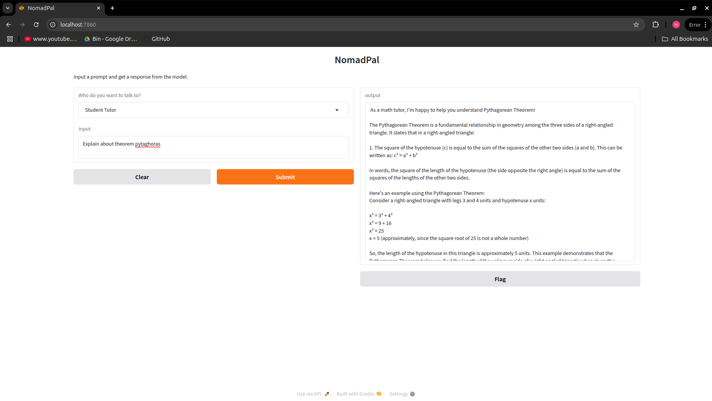

# NomadPal
Helping remote students in low-connectivity areas access personalized, AI-powered learning and Q&amp;A, completely offline, using a lightweight local language model and user-friendly interface.

## 🛠️ Tools Used

1. **[Ollama](https://ollama.com/)** – Local LLM model serving backend
2. **[FastAPI](https://fastapi.tiangolo.com/)** – High-performance backend API framework for serving model inference
3. **[Gradio](https://gradio.app/)** – User-friendly graphical interface for interacting with the models
4. **Docker** [**Coming Soon**] – Containerization for simplified deployment and scalability
5. **Database** [**Coming Soon**] – Store and retrieve previous inference results for persistence

---

## 🚀 Features

- Serve LLMs locally using Ollama
- API access to model responses via FastAPI
- Interactive UI for testing and experimentation using Gradio
- Modular design for easy extensions
- Docker support coming soon
- Database integration planned for saving/loading session history

---

## ⚙️ Installation

[**Coming Soon**]